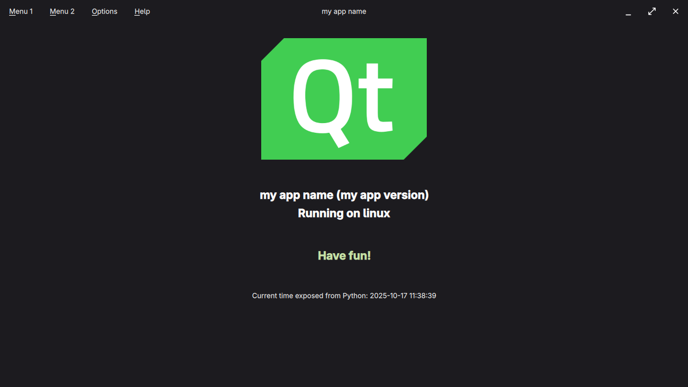

# PySide6 + QtQuick Project Template (Unofficial)

Unofficial opinionated project template to get started with PySide6 and QtQuick quickly without worrying about tooling.



# Features

* Compatible with Python **3.9+**
* Internationalization including (LTR/RTL)
* Resources compiled ahead of time:
    * Everything in `data`, `i18n`, and `qml` will be compiled into a Python file
    * Final build only consists of Python files
* Testing preconfigured (Python + Qml)
* CI preconfigured
* Client side window decorations implemented
* Qt creator not required (use your favorite text editor)

# Development Setup

## Quick Start

This project assumes that a virtual environment is used.

1. Set up the development environment for your OS
    * [Linux](docs/dev-setup-linux.md)
    * [Windows](docs/dev-setup-windows.md)
2. Run `just build-develop` to compile resources
3. Run `python main.py` to start the app

## Just recipes

```just
$ just --list
Available recipes:
    [build]
    build                  # Build full project into build/release
    build-develop          # Build and compile resources into source directory
    clean                  # Remove ALL generated files

    [i18n]
    add-translation locale # Add new language
    update-translations    # Update *.ts files by traversing the source code

    [test]
    test                   # Run Python and QML tests
    test-python            # Run Python tests
    test-qml               # Run QML tests
```

## Workflow

Run `just build-develop` after each change in the `data`, `i18n`, or `qml` directories.
This will *compile* everything into a Python file and move it into the `myapp` directory
where it will be picked up on app start.

## Internationalization

* Adding new languages is described [here](docs/internationalization.md)

## Read Further

* Qt6: https://doc.qt.io
* Python: https://www.python.org
* PySide6: https://doc.qt.io/qtforpython/contents.html
* QML Coding Conventions: https://doc.qt.io/qt-6/qml-codingconventions.html
* Python & Qml: https://doc.qt.io/qtforpython/PySide6/QtQml/index.html
* Scripting: https://doc.qt.io/qt-6/topics-scripting.html
* Importing JavaScript Resources in QML: https://doc.qt.io/qt-6/qtqml-javascript-imports.html
* Qt, QtQuick & Python examples are located in `venv/lib/<python-version>/site-packages/PySide6/examples`
  after dev environment is set up completely

# Dependencies

* PySide6 https://pypi.org/project/PySide6
* PyTest https://pypi.org/project/pytest
* Just https://github.com/casey/just

* App Icon: https://commons.wikimedia.org/wiki/File:Qt_logo_2016.svg
* Material Icons: https://fonts.google.com/icons?selected=Material+Icons

# FAQ

* Only **PySide6**? Can I substitute **PySide6** with **PyQt6**?
  > No. Resources will be compiled ahead of time and PyQt6 dropped support for this.
