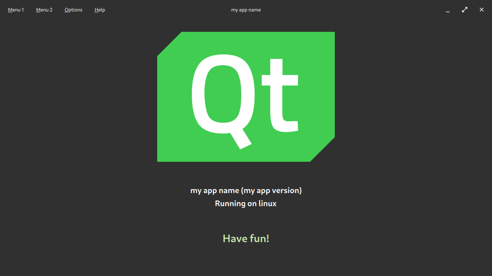

# Unofficial Opinionated Template for PySide6 with QtQuick

An unofficial and opinionated project template designed for a quick start with PySide6 and QtQuick.
This template is primarily intended for **fast prototyping** and for learning how to build applications with **QtQuick**.



## Features

- Compatible with Python **3.9+**
- Supports internationalization,
  including [Right-to-Left User Interfaces](https://doc.qt.io/qt-6/qtquick-positioning-righttoleft.html)
- Leverages the [Qt Resource System](https://doc.qt.io/qt-6/resources.html) to compile resources in `data`, `i18n`, and
  `qt/qml` into a Python file:
  - `data` accessible at `:/data` or `qrc:/data`
  - `i18n` accessible at `:/i18n` or `qrc:/i18n`
  - `qt/qml` accessible at `:/qt/qml` or `qrc:/qt/qml`
- Final build consists solely of Python files
- Preconfigured testing with **pytest** for Python and **qmltestrunner** for QML
- CI setup included
- Client-side window decorations implemented
- No need for Qt Creator; use your preferred text editor

## Development Setup

1. **Install these tools**

   - [Compatible Python version](https://www.python.org/downloads)
   - [uv](https://github.com/astral-sh/uv)
   - [just](https://github.com/casey/just)
   - **Windows users also need**
     - [Git Bash](https://git-scm.com/downloads)
     - Be sure to run `just` inside Git Bash

2. **Clone the repository**

3. **Open a terminal** where you cloned it

4. **Initialize the environment**:

   ```shell
   just init
   ```

## Workflow

Whenever you change files in the `data`, `i18n`, or `qt/qml` directories, run:

```shell
just build-develop
```

This compiles them into a Python file which is picked up during startup.

To start the app, run:

```shell
uv run main.py
```

**Tip:** Configure your IDE to run the `build-develop` recipe before launching the application.

## Just recipes

The provided `just` recipes automate common tasks such as building resources, running tests, and adding translations.

```just
$ just --list
Available recipes:
    [build]
    build                   # Build full project into build/release
    build-develop           # Build and compile resources into source directory
    clean                   # Remove ALL generated files
    init ARGS='--group dev' # Initialize repository

    [i18n]
    add-translation locale  # Add language; pattern: language-region ISO 639-1, ISO 3166-1; example: fr-FR
    update-translations     # Update *.ts files by traversing the source code

    [test]
    test                    # Run Python and QML tests
    test-python             # Run Python tests
    test-qml                # Run QML tests
```

## Internationalization

- Instructions for adding new languages can be found [here](docs/internationalization.md).

## Read Further

- Qt6: https://doc.qt.io
- Python: https://www.python.org
- PySide6: https://doc.qt.io/qtforpython/contents.html
- Examples for Qt, QtQuick & Python: https://pypi.org/project/PySide6-Examples/
- QML Coding Conventions: https://doc.qt.io/qt-6/qml-codingconventions.html
- Python & QML: https://doc.qt.io/qtforpython/PySide6/QtQml/index.html
- Scripting: https://doc.qt.io/qt-6/topics-scripting.html
- Importing JavaScript Resources in QML: https://doc.qt.io/qt-6/qtqml-javascript-imports.html
- Packaging on Linux: https://github.com/andyholmes/flatter

## Dependencies

- PySide6: https://pypi.org/project/PySide6
- PyTest: https://pypi.org/project/pytest
- Just: https://github.com/casey/just
- App Icon: https://commons.wikimedia.org/wiki/File:Qt_logo_2016.svg
- Material Icons: https://fonts.google.com/icons?selected=Material+Icons

## Apps Made with This Template

- mpvQC (https://mpvqc.github.io)

Create a Pull Request to add your app to the list 😊

## Upgrade Path

Upgrading from `v0.0.3` or earlier to `v1.0.0` requires some adjustments:

- Python source files are now located in `src` (previously: `myapp`).
- QML files are now in `qt/qml` (previously: `qml`).
- Translation files now use a hyphenated locale format, e.g. `fr-FR` (previously: `fr_FR`).

## FAQ

- Is it exclusively **PySide6**? Can **PyQt6** be used instead of PySide6?
  > Yes, it should be possible but may require additional work.
